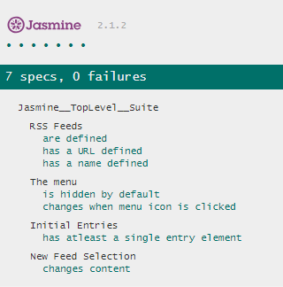

		#Feed Reader Testing

A project for testing the feed reader application.

* [Jasmine](https://jasmine.github.io/index.html) is used as the framework for testing the application.
* Download the repository and open index.html to run the application.
* The test results will be diplayed by the Jasmine at the bottom of the page.
* Open jasmine/spec/feedreader.js file for the test codes.

Checkout the live page here : https://vismayasurendran.github.io/Feed-Reader-Testing/

